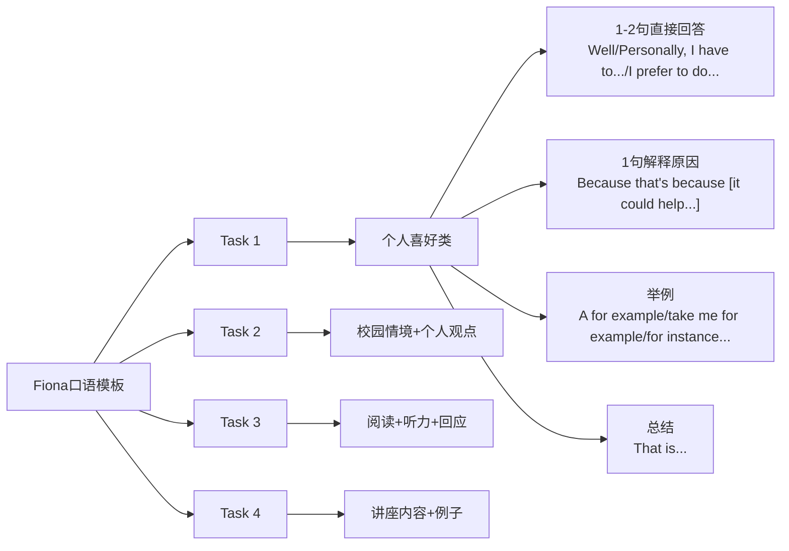

# 通用高分万能模板

<button onclick="BackToTop('2')" class="BackToTop">返回 “托福”</button>

---

## 核心思路导图

## 通用万能模板（4步结构）

| 步骤 | 英文模板 | 中文解释 | 示例 |
|------|----------|----------|------|
| 1    | Well/Personally, I have to say that... I prefer to... / I'd rather... | 直接表态（1-2句） | Well, personally, I prefer living in a big city. |
| 2    | The reason why I say so is mainly that... Because... / The main reason is... | 解释原因（逻辑清晰） | Because there are more job opportunities and better education resources. |
| 3    | For example, take me/my friend for example... For instance, last time... | 具体举例（最加分！） | For example, my cousin moved to Shanghai last year and found a high-paying job within a month. |
| 4    | That's why I think... So that's the main reason. | 小总结收尾 | That's why I believe living in a big city is better for young people. |

## Task 1 & Task 2 最常用完整模板

> Well, personally, I would say that I prefer to \[直接回答观点].
> The main reason is that \[原因1], and also \[原因2].
> For example, take me for example, \[具体例子，越真实越好].
> That's why I think \[小总结，重复观点].

### 示范典例

> Well, personally, I prefer to study with others rather than alone.  
> There are two main reasons. First, when I study with classmates, we can discuss difficult problems together and learn from each other. Second, it helps me stay focused because I feel more motivated in a group.  
> For example, last semester when preparing for the final exam, I joined a study group. We met twice a week in the library, and I ended up getting an A in that course.  
> That's why I think studying with others is more effective for me.

## Task 3 阅读+听力+回应模板（校园情境类）

1. **阅读内容**：The university is going to \[政策].  
	→ Two students are talking about it.

2. **听力男生/女生观点**：
	- He/She supports it because...
	- He/She disagrees because...

3. **你的回应模板**：

> The woman/man in the conversation \[supports/disagrees with] the university's plan.  
> She/He gives two reasons.  
> First, she says that \[理由1].  
> And in the reading, it says that \[对应阅读内容].  
> Second, she mentions that \[理由2].  
> For example, she says that \[听力中的例子].

## Task 4 学术讲座模板（最简单！）

> In the lecture, the professor mainly talks about \[讲座主题].  
> He/She gives two examples to explain it.  
> The first one is \[例子1].  
> The second one is \[例子2].  
> And that's how the professor explains the concept.

## 超强总结口诀

> 1. Well, personally, I have to...
> 2. Because... (原因1 + 原因2)
> 3. For example, take me for example...
> 4. That's why I think...
